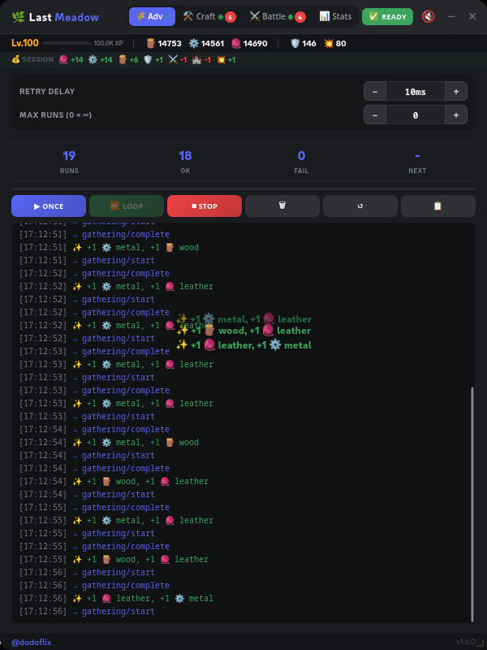
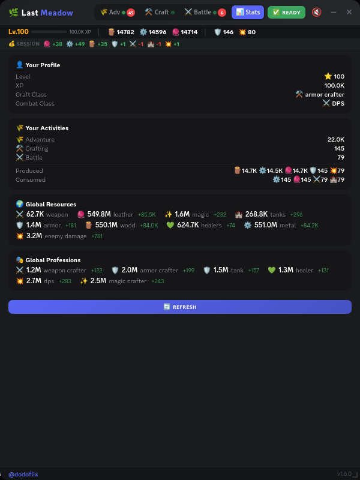

# 🌿 Last Meadow Online — Automation

> ⚠️ For educational purposes only — use at your own risk.

Automates adventure, crafting, and battle cycles for [Last Meadow Online](https://discord.com/last-meadow-online) on Discord.

## Installation

### Browser Extension

Download from the [Releases page](https://github.com/dodoflix/last-meadow-online-automation/releases):

**Chrome / Edge / Brave:**
1. Download `chrome-extension.zip` and unzip it
2. Go to `chrome://extensions` → enable **Developer mode**
3. Click **Load unpacked** → select the folder

**Firefox:**
1. Download `firefox-extension.zip`
2. Go to `about:debugging#/runtime/this-firefox`
3. Click **Load Temporary Add-on** → select the zip

The extension auto-updates — it always loads the latest script from GitHub on each page load (cached 1 hour). No need to reinstall when a new version is released.

### Console Script

1. Open [discord.com](https://discord.com) and press `F12`
2. Go to **Console** tab
3. Paste [`src/content.js`](src/content.js) or `console-script.min.js` from [Releases](https://github.com/dodoflix/last-meadow-online-automation/releases)

Paste again to remove, or click ✕.

## Usage

A floating panel appears with 4 tabs:

| Tab | Activity | Cooldown |
|-----|----------|----------|
| 🌾 Adventure | Gathering | Instant |
| ⚒️ Craft | Crafting | 2 min |
| ⚔️ Battle | Combat | 3 min |
| 📊 Stats | Profile & counters | Auto-refresh |

Credentials are captured automatically — just interact with Discord (switch channel, open DM) after the panel loads.

Each tab has **Loop**, **Once**, **Stop** controls with configurable retry delay and max runs. Craft & Battle check materials before attempting and pause Adventure during requests. The footer shows current version and notifies when an update is available.

## Screenshots




## Building

```bash
git clone https://github.com/dodoflix/last-meadow-online-automation.git
cd last-meadow-online-automation
npm install
npm run build
```

Releases are automated with [release-please](https://github.com/googleapis/release-please).

## License

MIT — [Dogukan Metan](https://github.com/dodoflix)
